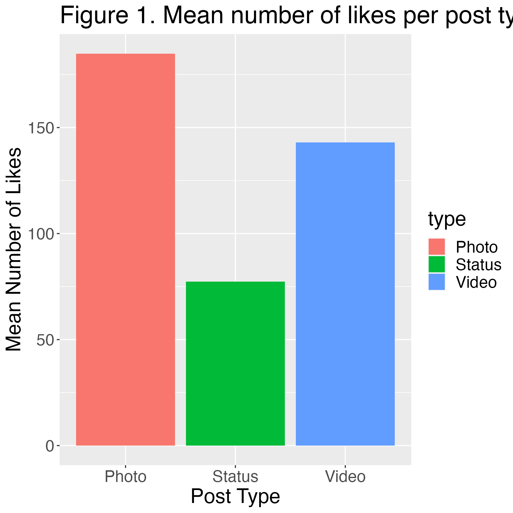
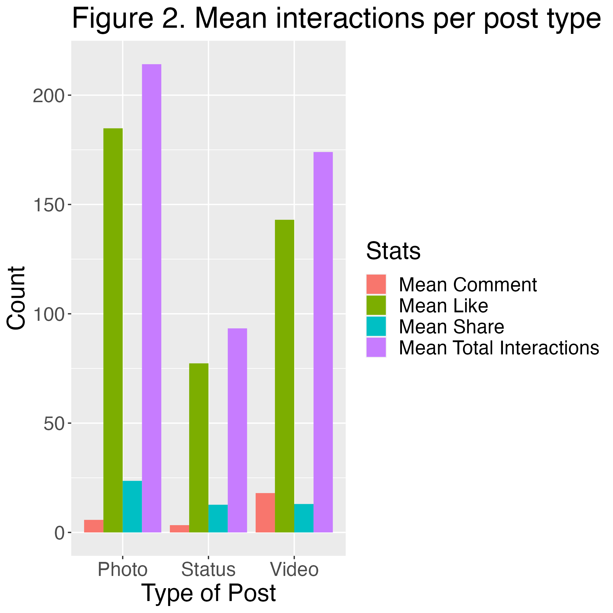
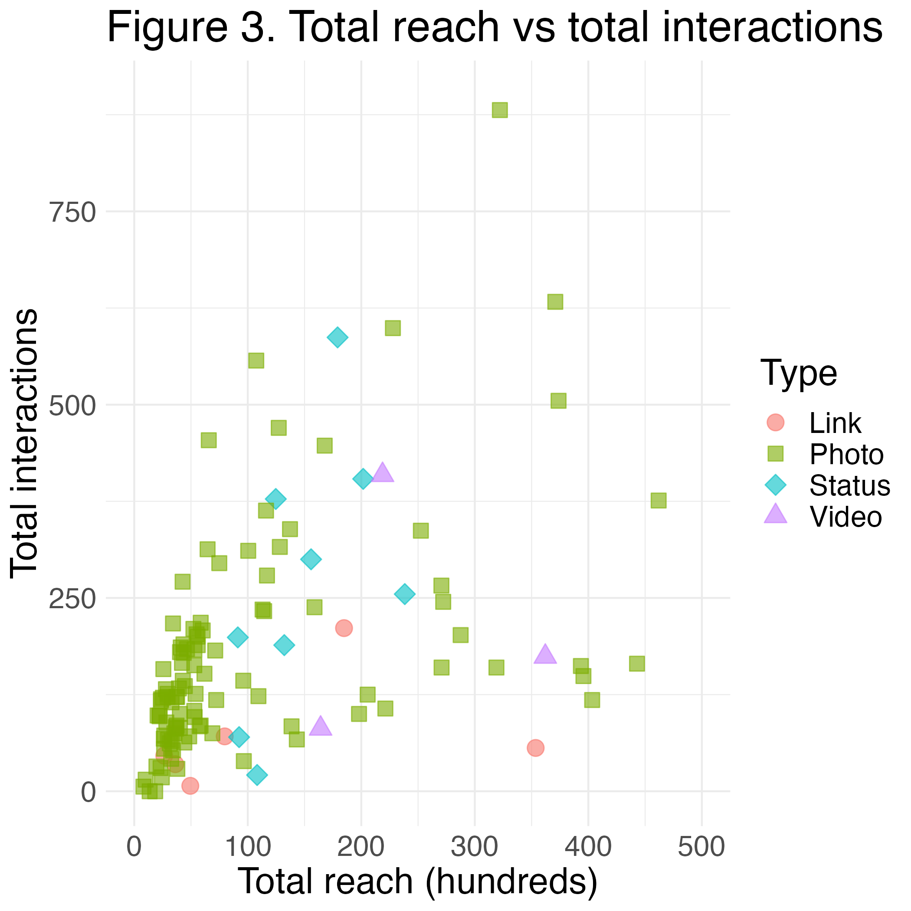
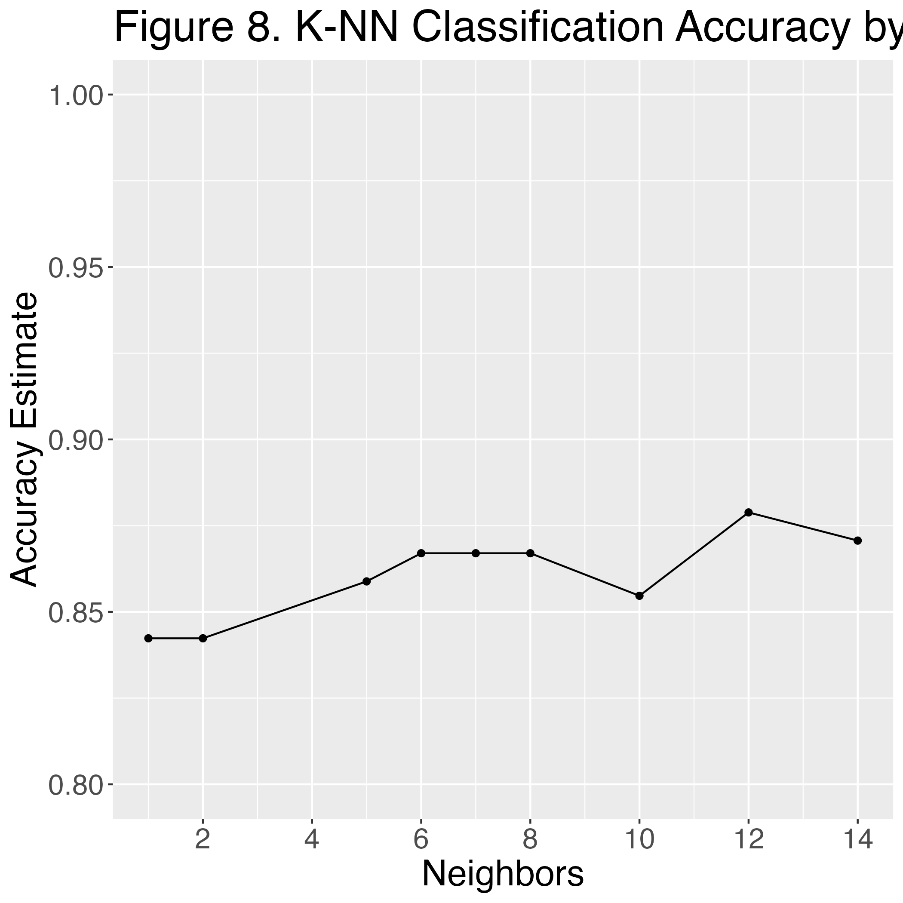

Original Analysis By: Sara Jafroudi, Enoch Cheung, Jason Ngo, Bruno Gagnon

---
Reproduced for DSCI310 project || Group 12: Enoch Cheung

# Introduction

## Research Question:
How can an author increase engagement from users on Facebook and can we predict the success of a post using insights from an author's page?

## Overview:
The market utility of social media platforms such as Facebook, which are able to generate mass revenues for cosmetic brands, has been an established and exploited advertising strategy in the digital age [@moro].
The goal of this project is to take a predictive analytical approach to determine which type of Facebook post (i.e., photo, video, status, or link) will engage the most internet-user engagement, determined through variables such as likes, post consumptions, and post total reach.
The dataset which will be used for this analysis was acquired through an experimental data mining technique which included scraping data from the Facebook page of an internationally renowned cosmetics company on posts made between January 1st and December 31st [@moro].

We will use the variables of the continuous numerical variables of total reaches (Lifetime_Post_Total_Reach) and the number of total interactions (Total_Interactions), and the categorical variable of Facebook post (Type).
We chose the two continuous numerical variables of total reach and total interactions as predictors because they are key indicators of success that are interrelated.
Although we do not consider factors such as the type of users (influencers, company profiles, regular users, etc.), the variable of total reach must be put in relations with total interactions to offer a valuable insight.
That is because total interactions influence Facebook's algorithm that may result in a viral post and thus increase the total reach regardless of the extent of the user's total network (e.g. number of friends and affiliated groups) [@Quesen].
Therefore, the variables of total reach and total interactions must be paired to fully grasp the success of a post as both can create a positive feedback loop. 

For the methodology, we will look at the relationship between these variables in a scatter plot graph that will help us to formulate our hypothesis.
Then, as we are trying to predict the type of post that will be the most successful, we will use a K-nearest neighbour classification analysis.
To do so, we must determine the K value using cross-validation of the training data.
Then, we will need to test the accuracy of the classifier with the testing data.

We expect to find that posts which include media, such as photos and videos, are more likely to engage users than other posts, such as statuses and links.
This is based on the assumption that the former types of posts might be more likely to be shared and thus will have more exposure.
It is beneficial for social media platforms to increase user engagement, as this is likely to increase revenue through advertising.
Therefore, these findings may be used to choose what type of posts are prioritized to maximize user engagement.

These findings may lead to further exploration of how the contents of these posts impact user engagement.
This may include the duration of a video, content of an image, length of a status, or details about the contents of a link. 

```{r setup, include=FALSE}

# set cran mirror
r = getOption("repos")
r["CRAN"] = "http://cran.us.r-project.org"
options(repos = r)

#libraries

install.packages("docopt")
install.packages("bookdown")
install.packages("knitr")
install.packages("rmarkdown")
install.packages("tinytex")

library(readr)
library(docopt)
library(dplyr)
library(ggplot2)
library(tidyr)
library(grid)
library(gridExtra)
library(kknn)
library(repr)
library(cowplot)
library(tidyverse)
library(tidymodels)
library(caTools)
library(bookdown)
library(knitr)


knitr::opts_chunk$set(echo = FALSE, warning = FALSE, message = FALSE)

```


# Methods & Results

```{r options, include=FALSE}
options(repr.matrix.max.rows = 8)
options(warn = -1)
```

## Tidying Data

Let us select only the variables relevant to our analysis.

To specify the best type of post possible and to explore the relationship between the metrics produced by a post and the post type.
We determined that the following key performance indicators best describe a post's success:
- comments
- likes
- shares
- total interactions (summation of the 3 observations above) 


Within our 500 data points collected, we have filtered out all observations with NA values and separated our data into paid and unpaid categories due to additive relationships.
This allows us to explore the relationship between post type and our defined success metric.
Moving forward, this study will only evaluate on media postings without paid advertising.

> Note:
Social media algorithms that adjust prioritizations between paid and non-paid posts can heavily factor into our metrics received and should be considered in this analysis.
To control for this potential source of uncertainty, we have isolated our data into paid and unpaid categories. 

## Training, Validation, and Testing Sets 

### Compartmentalization
We have split our data into training and testing sets in order to reduce bias within our model data and testing data. 

*Distribution of Training and Testing set*
<br>
- Testing set will be 20% of data collected
<br>
- Validation set will be 10% of data collected
<br>
- Training data set be 70% of data collected

*Cross-validation technique*
<br>
let us split our data into 10 total groups.
<br>
(~25 points tested, 100 points for training)

We chose to approach our training data by creating a 80:20 ratio between testing and training data where the  training set is composed of both the “validation” and “training” set.
We have also chosen a 10-fold cross-validation procedure to establish unbiased estimators.

## Preprocessing 

### Preliminary Data Analysis

To inform our analysis later on, we first conducted a preliminary exploration of our dataset.

In order to gain more insight on the relationship between each type of post and the magnitude of its interactions, we started by taking the mean value of each interaction type with respect to each post type. Then we compare the likes per post type.

```{r meanLikesByPostType, echo=FALSE, fig.cap="Mean likes by post type"}

```

We can see from the graph above that videos tend to receive significantly more likes than other post types. Additionally, photos and status posts receive similar number of likes compared to each other. Links receive significantly fewer likes than all other types of posts.
<p>
If we repeat this process without filtering for likes, we can compare the engagement per post across all types of engagement.

```{r meanInteractionsbyPostType, echo=FALSE, fig.cap="Mean Interactions by post type"}

```

From this graph, we can see that the ratio between the amounts of engagement for different types of post are roughly equal regardless of the type of interaction.
Additionally, all types of posts tend to receive very few comments and shares compared to the number of likes.

```{r totalReachVsInteractions, echo=FALSE}

```


## Building our Model

### Overview
We use the original training data into our tuning selection process.
Then by scaling the data and following the tidymodel recipes workflow, we collect the results from various values of $k$.
Our base value of $k$ is set to 3.

Our pre-tuned model accuracy against our validation set was roughly 83%. The low accuracy is connected with the collection of observations within the validation data set itself. Our validation set which was sampled at random had only included observations from 2 types: Photo and Status. Upon running our model against this sample population, the collection of predictions included observations from the Link category as well thus creating inaccuracy in our model. In the following steps, we will hopefully tune and increase our base accuracy while accounting for the small sample of the validation set.

### Tuning

1. We will perform the cross-validation technique with 10 folds to account for randomness.

Through a 10 fold cross-validation method, the accuracy of our model averages to approximately 87%. Given a standard error of roughly 0.01, our estimated true average accuracy falls between $[0.86, 0.88]$. The increase in accuracy can be explained through the choice of data used in the "vfold()" function. The validation set created from the **vfold()** function splits our training data into subsections while the prediction model compares the validation set against the predicted values. Thus with a better holistic representation of our sample, our accuracy increases.

2. Next we will perform a parameterization selection method to select a better value for K.


3. Then using our collected metrics, we can visualize our accuracies to refine our value of K.

```{r knnAccuracy, echo=FALSE}

```

The visualization suggests that $k=12$ averages the highest accuracy of ~88% from our 10 cross-validation sets.
We edit our model specification to take $k=9$ instead of $k=3$ as follows.
After doing so, we can compare the accuracy of each model.

## Results

After changing our model spec from $k$ = 3 to $k$ = 12, we see that the modifications to our model have increased our accuracy by *8.3%*, (i.e., from *83.33%* to *91.67%*) and thus we will choose the tuned model.

A possible reason the unusually high value of $k$ may lie within the validation data set. As previously discussed, the validation set was a poor holistic representation of our sample and to account for false positives, the model produced a higher critical value.

Note that throughout our procedure, we chose to use only the unpaid posts as paid posts introduce a new variable that is the amount paid for the advertisement.
This variable affects the length of time being promoted and the scope that targets specific audiences and thus is more likely to interact with the post.

We also used the variables "total interactions", which is the aggregation of the variables "like", "share", and "comment", and "lifetime total reach" which refers to the number of views, as predictors to predict the type of post.
Based on our tuned model, we can predict which type of post will be successful with an accuracy of 91.67%.

# Discussion

Our model has shown the most accuracy with a $k$ value of 12 and with an accuracy of 91.67%.
We ran into the problem of an unbalanced dataset where videos, links, and statuses made up only 54 of 264 total observations.
Our model decided to acknowledge this unbalance and leave it as is for the reason that by balancing it, it drastically biased our model to produce a very high accuracy rate (roughly 96%).
Considering that without balancing the dataset, the accuracy rate of our model at 91.67% was good enough. 

As our research question asks which type of posts will be the most successful, our model first demonstrated the positive relationship between total impressions and total reach by type of posts which allowed to use them as our two main predictors.
Our model showed that as total reach increases total impressions (likes, shares, comments) are likely to increase as well.
Therefore, the underlying logic of our question is which type of post is likely to have the most reach, but as the type of content, such as videos or links, affects the likeliness of generating likes and comments which, in turns, is more likely to be picked up by Facebook's algorithm to then become viral.
Thus, it creates a positive feedback loop as viral posts, if made public, increase Facebook's placement of the post in user's newsfeed resulting in an increased reach [@Quesen].

Therefore, we used both total reach and total impression to predict the success of a Facebook post.


# References